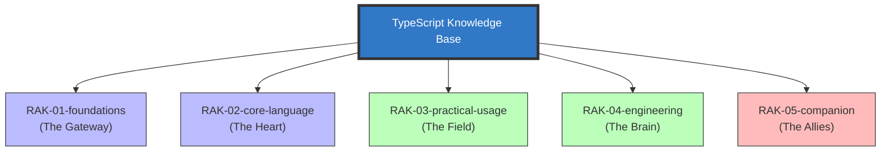

# TypeScript Knowledge Base

> **"Membangun Fondasi yang Kokoh di Atas Dinamisme JavaScript."**

## Latar Belakang & Visi
Seringkali saat kita menulis JavaScript, kita merasa seperti sedang berjalan di kegelapan tanpa senter. Bug muncul tiba-tiba saat runtime, dan kita baru menyadarinya setelah aplikasi "meledak" di tangan pengguna.

**TypeScript Knowledge Base** adalah manifestasi dari perjalanan saya menaklukkan dinamisme tersebut. Saya mendekomposisi documentation TypeScript yang luas menjadi unit-unit kecil yang manusiawi menggunakan analogi **Perpustakaan Digital**. Di sini, kita tidak hanya belajar sintaks, tapi memahami *bagaimana* dan *kenapa* sistem tipe itu ada.

## Tujuan (Objectives)
1. **Portofolio**: Menunjukkan kedalaman teknis dalam memahami sistem tipe struktural.
2. **Catatan Belajar Personal**: Dokumentasi perjalanan dari pengembang JS menjadi TS Architect.
3. **Shareable Resource**: Referensi terpercaya bagi rekan pengembang untuk memahami konsep sulit (seperti Generic atau Conditional Types).
4. **Living Documentation**: Selalu diperbarui mengikuti rilis terbaru dari tim TypeScript.

## Mengenal TypeScript: "The Transformer" 🤖

Sebelum masuk ke teknis, kita perlu memahami **apa** TypeScript itu sebenarnya. TypeScript bukanlah bahasa baru yang berdiri sendiri, melainkan **Superset** dari JavaScript yang bertindak sebagai **Transformer**.

### 🎭 Analogi: "Sinar X & Kerangka Robot"
Bayangkan JavaScript adalah sebuah gumpalan tanah liat (dinamis, bebas dibentuk, tapi rapuh). Anda bisa membuat apapun, tapi sulit memastikan kekuatannya.

**TypeScript** memberikan Anda **Sinar X** dan **Kerangka Robot**. 
- **Sinar X**: Memungkinkan Anda melihat "ke dalam" kode Anda (tipe data) sebelum kode itu dijalankan.
- **Kerangka Robot**: Memberikan struktur yang kaku dan kuat pada tanah liat tadi. Jika Anda mencoba memasang tangan robot ke kaki, sang *Compiler* akan segera berteriak sebelum robot itu mencoba berjalan.

TypeScript mentransformasi JavaScript yang "menebak-nebak" menjadi sistem yang "tahu pasti".

### 🚀 Mengapa Menggunakan TypeScript?

1.  **Dukungan IDE yang Luar Biasa**: *Autocompletion* dan *Refactoring* menjadi sangat akurat karena IDE tahu persis bentuk data Anda.
2.  **Mencegah Bug di Masa Depan**: Menangkap kesalahan bodoh (seperti `undefined is not a function`) saat Anda baru saja mengetiknya.
3.  **Dokumentasi yang Hidup**: Tipe data adalah dokumentasi terbaik. Anda tidak perlu menebak apa isi sebuah objek; tipe datanya memberitahu Anda.
4.  **Skalabilitas**: Di proyek besar, TypeScript adalah satu-satunya cara untuk memastikan perubahan di satu sisi tidak merusak sepuluh sisi lainnya secara diam-diam.

---

## Struktur Perpustakaan (5-Rack Architecture)
Repositori ini menggunakan standar **PPM (Perpustakaan Pribadi Modular)** dengan hierarki:
**Rak -> Sub-Rak -> Buku -> Bab -> Section.**

---

## Roadmap & Status Pengembangan (Draft Plan)

| Rak | Deskripsi | Status |
| :--- | :--- | :--- |
| `RAK-01-foundations/` | Intro, Syntax, Tutorial, & First Principles | *Planned* |
| `RAK-02-core-language/` | Type System, Generics, & Advanced Types | *Planned* |
| `RAK-03-practical-usage/` | App Modeling, Runtime Boundaries, & Patterns | *Planned* |
| `RAK-04-engineering/` | Compiler (tsc), Project Arch, & Testing | *Planned* |
| `RAK-05-companion/` | Ecosystem & Release Notes | *Planned* |

## Visi Aktif
Repositori ini bertindak sebagai **"The Brain"** dalam *Master Plan: Polyglot Senior Architect*. Fokus materi murni pada **TypeScript Language & Ecosystem**.

---
*Dokumentasi Lengkap & Roadmap: [docs/README.md](./docs/README.md)*
*Panduan Struktur & Standar: [docs/standards/architecture.md](./docs/standards/architecture.md)*
