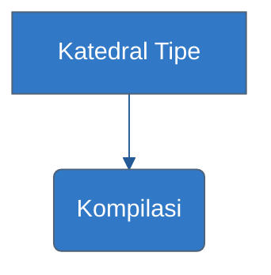

# Panduan Estetika Visual (TS Edition)

Setiap diagram dan aset visual dalam TypeScript Knowledge Base harus terlihat premium dan konsisten.

## 1. Skema Warna (Branding)
- **Primary Color**: `#3178C6` (TS Blue) - Gunakan untuk node utama.
- **Secondary Color**: `#235A97` (Dark Blue) - Gunakan untuk border atau grup.
- **Highlight**: `#f0dc4e` (JS Yellow) - Gunakan untuk area integrasi dengan JavaScript.

## 2. Standar Mermaid
Gunakan konfigurasi berikut untuk diagram alur:

## 3. Simbol Visual
- **Kotak Tajam**: Mewakili **Interface** atau **Class**.
- **Oval**: Mewakili **Function** atau **Logic Flow**.
- **Warna Gradasi**: Digunakan untuk menunjukkan **Type Evolution** atau **Migration**.
